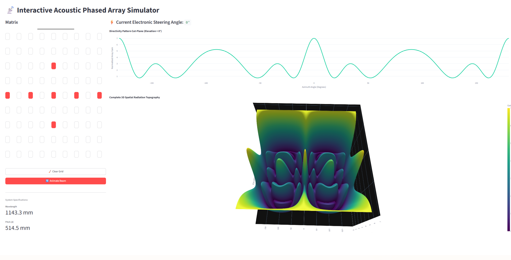
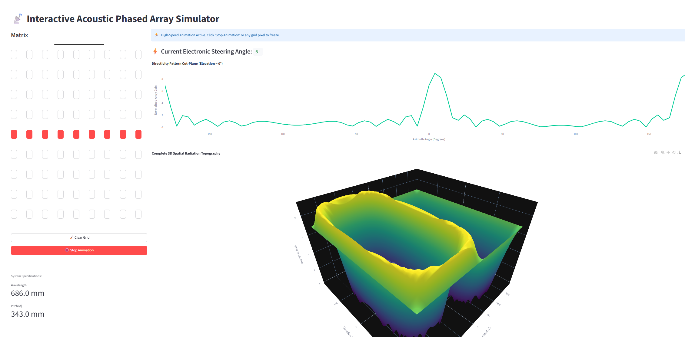

# 2D Acoustic Phased Array Beamforming Simulator

Interactive Python simulator for a **phased array receiver**.  
Visualizes beam patterns with steering angle control, tilting, and both 2D/3D plots.

### Demo Videos & Results

**Tilting Beam Animation**  


**3D Beam Pattern Examples**  
  


## Features
- Configurable NxN element phased array (tested with 9x9)
- Programmable frequency and element spacing
- Beam steering and tilting visualization
- 2D heatmap + 3D beam pattern rendering
- Real-time parameter adjustment

## Installation

```bash
git clone https://github.com/uptowncow886/2d-acoustic-phase-array-beamforming-simulator.git
cd 2d-acoustic-phase-array-beamforming-simulator
pip install -r requirements.txt
